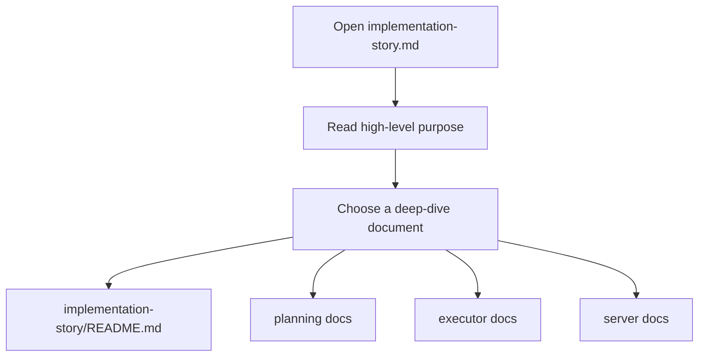

# Implementation Story

The codebase documentation now lives in a mirrored markdown tree instead of a single monolithic file.

This docs tree is also the place to describe intended architectural changes before implementation. Some markdown files therefore describe the target structure, even if the Python code has not been refactored yet.

Primary entry point: [implementation-story/README.md](implementation-story/README.md)

Structure notes:

- `docs/implementation-story/` mirrors the main source tree under `mcp_shared/`, `mcp_apps/`, `mcp_clients/`, and `mcp_servers/`.
- Each documented source file has a matching markdown file with the same relative path and a `.md` suffix.
- The mirrored tree excludes generated folders such as `__pycache__`, virtualenv files, and other non-source artifacts.

Quick links:

- [mcp_shared/config/env_loader.py.md](implementation-story/mcp_shared/config/env_loader.py.md)
- [mcp_apps/orchestrator/app/orchestrator.py.md](implementation-story/mcp_apps/orchestrator/app/orchestrator.py.md)
- [mcp_apps/orchestrator/app/dag_builder.py.md](implementation-story/mcp_apps/orchestrator/app/dag_builder.py.md)
- [mcp_apps/orchestrator/app/context_compactor.py.md](implementation-story/mcp_apps/orchestrator/app/context_compactor.py.md)
- [mcp_clients/agent_executor/client/worker.py.md](implementation-story/mcp_clients/agent_executor/client/worker.py.md)
- [mcp_servers/filesystem_server/server/file_mutator.py.md](implementation-story/mcp_servers/filesystem_server/server/file_mutator.py.md)
- [mcp_servers/llm_server/server/agents/entrypoint.py.md](implementation-story/mcp_servers/llm_server/server/agents/entrypoint.py.md)

## Story

This file is the front desk for the documentation set. It explains what the implementation-story tree is for, points to the most important deep-dive files, and tells the reader how to move from the high-level overview into the detailed module documents.

## Terms

- `implementation-story tree`: The mirrored documentation set that describes source files one by one.
- `deep-dive document`: A more specific markdown file that focuses on one module or subsystem.
- `target structure`: A planned architecture described in docs even if the Python code has not been refactored yet.

## Mermaid

