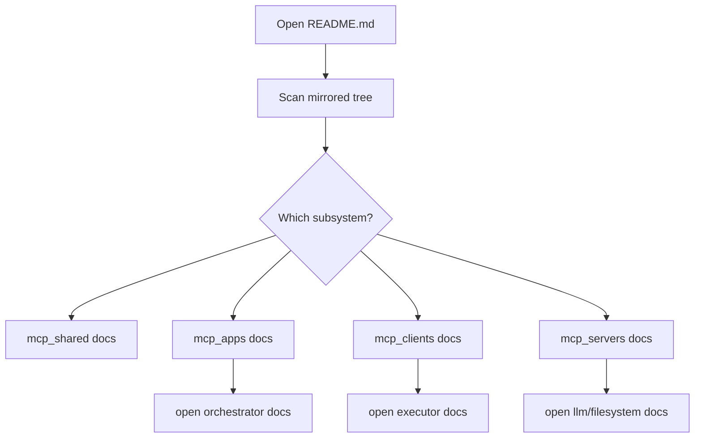

# Implementation Story

This directory mirrors the main code layout with one markdown file per source file.

This directory also acts as the design-review surface for planned refactors. When a markdown file describes a module that does not exist yet in Python, treat it as a proposed target file rather than current implementation.

## Story

This file is the map of the mirrored documentation tree. It tells the reader how the docs are organized, which source areas are covered, and where to start when reading about planning, execution, or server behavior.

## Terms

- `mirrored tree`: A docs folder layout that follows the same path structure as the source tree.
- `subsystem`: A grouped area of behavior such as orchestrator, executor, or server logic.
- `starting point`: A document chosen to begin reading a larger slice of the system.

## Scope

- Included: core source, prompt templates, and tests under `mcp_shared/`, `mcp_apps/`, `mcp_clients/`, and `mcp_servers/`
- Excluded: `.venv`, `__pycache__`, `.git`, build artifacts, and generated caches

## Mirrored Tree

```text
docs/implementation-story/
  mcp_shared/
    config/
      env_loader.py.md
  mcp_apps/
    __init__.py.md
    orchestrator/
      __init__.py.md
      app/
        main.py.md
        dag_builder.py.md
        context_compactor.py.md
        orchestrator.py.md
        planner.py.md
        researcher.py.md
        state_manager.py.md
        trace_exporter.py.md
        prompts/
          planner_prompt.txt.md
      libraries/
        auth/
          api_converter.py.md
          playwright_setup.py.md
          session_store.py.md
        providers/
          research_provider_factory.py.md
        types/
          contracts.py.md
      tests/
        __init__.py.md
        test_orchestrator_command_normalization.py.md
        test_planner_command_helpers.py.md
        test_researcher_resilience.py.md
  mcp_clients/
    agent_executor/
      client/
        mcp_router.py.md
        worker.py.md
      libraries/
        types/
          contracts.py.md
      tools/
        flow_parser.py.md
        response_parser.py.md
  mcp_servers/
    __init__.py.md
    filesystem_server/
      server/
        file_mutator.py.md
        index.py.md
    git_server/
      server/
        index.py.md
    llm_server/
      __init__.py.md
      libraries/
        types/
          contracts.py.md
      server/
        index.py.md
        providers.py.md
        trace_logger.py.md
        handlers/
          llm_handler.py.md
        agents/
          entrypoint.py.md
          modules/
            defaults.py.md
            offline_fallback.py.md
            runtime_loader.py.md
          vendors/
            gemini_agent.py.md
            openai_agent.py.md
            qwen_agent.py.md
            registry.py.md
      tests/
        __init__.py.md
        test_agent_api_callability.py.md
```

## Suggested Starting Points

- Planning flow: [mcp_apps/orchestrator/app/orchestrator.py.md](mcp_apps/orchestrator/app/orchestrator.py.md)
- DAG construction spec: [mcp_apps/orchestrator/app/dag_builder.py.md](mcp_apps/orchestrator/app/dag_builder.py.md)
- Agent handoff spec: [mcp_apps/orchestrator/app/context_compactor.py.md](mcp_apps/orchestrator/app/context_compactor.py.md)
- Executor flow: [mcp_clients/agent_executor/client/worker.py.md](mcp_clients/agent_executor/client/worker.py.md)
- Safe file edits: [mcp_servers/filesystem_server/server/file_mutator.py.md](mcp_servers/filesystem_server/server/file_mutator.py.md)
- Provider entrypoint: [mcp_servers/llm_server/server/agents/entrypoint.py.md](mcp_servers/llm_server/server/agents/entrypoint.py.md)

## Mermaid


