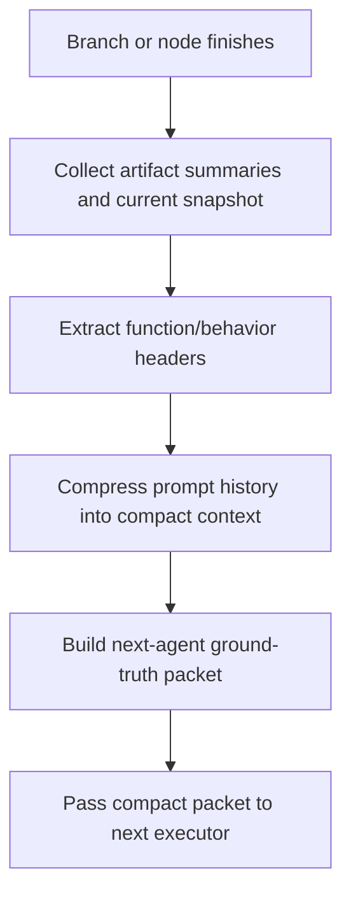

# `mcp_apps/orchestrator/app/context_compactor.py`

Source path: `mcp_apps/orchestrator/app/context_compactor.py`

Status: proposed target file for executor handoff compaction.

Role: Produce a compact, ground-truth handoff context when an agent branch ends, merges, or must be replaced by a fresh executor.

Responsibilities:

- Read branch-local outputs and artifact summaries
- Compile a stable abstraction of what the branch actually changed
- Convert large prompt history into a small handoff package
- Emit a header-style summary of relevant functions, behaviors, inputs, and outputs
- Provide the next agent with a reduced context that is treated as canonical for the current iteration

## Story

This file is the handoff editor. It takes the noisy history of a finished branch, reduces it to the smallest useful packet of ground truth, and prepares the compact context that the next low-context executor agent should trust.

## Terms

- `ground truth`: The compact summary the next executor should trust over older prompt history.
- `branch summary`: A reduced account of what one branch actually changed.
- `function header`: A compact line describing function name, purpose, input, and output.
- `low-context agent`: An executor that performs better when given only the minimum necessary context.

## Required Output Shape

- `artifact_path`
- `branch_summary`
- `function_headers`
- `known_constraints`
- `known_inputs`
- `known_outputs`
- `next_agent_ground_truth`

## Executor Output Format

The function-name, description, input, and output structure is not meant to be a markdown API reference. It is the compact runtime summary that one executor agent emits so the next executor agent can continue with low context.

Each summarized function or behavior block should include:

- Function name
- Short description
- Input parameters
- Output value or side effect

This is effectively a C++-header-like abstraction packet for the next executor, not for the human-facing docs.

Example runtime packet fragment:

```text
function: build_dag
description: Build the final execution DAG from normalized planning data.
input: planning_payload, workspace_context, research_brief
output: DagGraph
```

If the node is not about a single function, the same format can summarize behavior at a higher level:

```text
function: parser branch summary
description: Final parser path after branch merge; token stream is now treated as stable input.
input: token stream summary, parser constraints, accepted syntax cases
output: current parser ground truth for downstream nodes
```

## Ground-Truth Rule

- Once the compact packet is emitted, the next agent should trust that packet over older branch-local prompt text.
- The packet is meant to reduce context size and reduce ambiguity, not to preserve every intermediate thought.
- If there is a conflict between old raw conversation context and the compact packet, the compact packet wins for the next iteration.

## Mermaid


