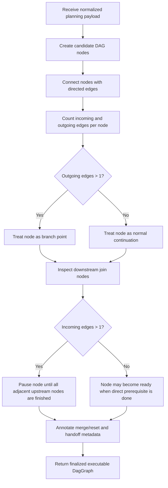

# `mcp_apps/orchestrator/app/dag_builder.py`

Source path: `mcp_apps/orchestrator/app/dag_builder.py`

Status: proposed target file for the scheduling and DAG-construction refactor.

Role: Single readable home for execution-graph creation. This module owns project-scheduling logic, node prerequisites, parallelism decisions, merge rules, and the final DAG layout.

Responsibilities:

- Build the execution DAG from intermediate planner output
- Determine prerequisites per node using project-scheduling rules rather than prompt order alone
- Detect branching and serialization from graph connectivity rather than assuming a fixed number of parallel nodes
- Detect branch joins and define merge/reset points
- Mark where the current executor must be retired and replaced with a fresh agent
- Emit a finalized DAG that the orchestrator can execute without recomputing scheduling rules

## Story

This file is the scheduler and graph constructor. It turns planning payloads into an executable DAG, decides where branches and joins exist, decides when a node must wait for all incoming work to finish, and annotates the graph with the metadata the executor side will need later.

## Terms

- `planning payload`: The structured planning data produced before final DAG construction.
- `prerequisite`: An upstream node that must finish before a downstream node can run.
- `incoming edge`: A dependency edge entering a node from an immediate upstream node.
- `outgoing edge`: A dependency edge leaving a node toward a downstream node.

## Scheduling Model

- Scheduling is driven by graph edges, not by assuming that a branch always means exactly two generated nodes.
- A node with exactly one outgoing edge is just a normal continuation step.
- A node with more than one outgoing edge is a branching point and may fan out into as many downstream paths as its outgoing edge count.
- A node with more than one ingoing edge is a join or prerequisite-collection point.
- A join node must pause until all immediately connected upstream prerequisite nodes have finished.
- Readiness for a join node is determined by comparing:
  the number of ingoing edges for that node
  the number of immediately adjacent upstream nodes connected to that node that are already finished
- If those counts do not match, the node remains blocked.
- If those counts match, the node becomes eligible to run subject to any additional safety constraints such as overlapping writes or invalid handoff state.
- Parallel execution is therefore inferred from the graph shape and dependency satisfaction, not from a hardcoded pairwise split.
- A prerequisite means a downstream node cannot start until the required adjacent upstream nodes have produced a stable artifact or stable abstracted context.
- A merge point is not just a graph join; it is also a context boundary where branch-local prompt history should stop.
- Agent resets should happen at branch merges, high-risk semantic shifts, or when the downstream node would be more accurate with a compact ground-truth summary than with full prompt accumulation.

## Executor Handoff Expectations

This file does not need a markdown-level function reference. The function-name, description, input, and output summary belongs to the runtime handoff packet generated after a node or branch has executed.

When DAG construction finishes, the executor-side handoff should preserve scheduling truth in compact form:

- Which nodes are blocked by which prerequisites
- Which nodes belong to the same parallel wave
- Which nodes create a merge boundary
- Which nodes require a fresh agent instead of agent reuse
- What downstream nodes are allowed to trust as their current baseline

The important point is that this summary is emitted for the next executor agent, not for the human-facing markdown structure.

## Required Node Metadata

- `node_id`
- `task_type`
- `target_file` or `target_scope`
- `prerequisites`
- `incoming_edge_count`
- `outgoing_edge_count`
- `parallel_group`
- `merge_role`
- `requires_fresh_agent`
- `handoff_strategy`
- `acceptance_checks`

## Runtime Summary Shape

When execution moves from one agent to the next, the compact scheduling summary should look more like an internal header than public docs. It should list the current scheduling truth in a compact machine-friendly and agent-friendly form:

```text
node: implement-parser
description: Implement parser logic after tokenizer is stable.
input: tokenizer artifact summary, parser target file, node constraints
output: parser implementation change set
prerequisites: build-tokenizer
parallel: no
fresh-agent: yes
incoming-edges: 1
outgoing-edges: 2
```

## Non-Goals

- This file should not perform model calls.
- This file should not mutate workspace files.
- This file should not manage runtime execution threads.
- This file should only build and annotate the graph.

## Mermaid


