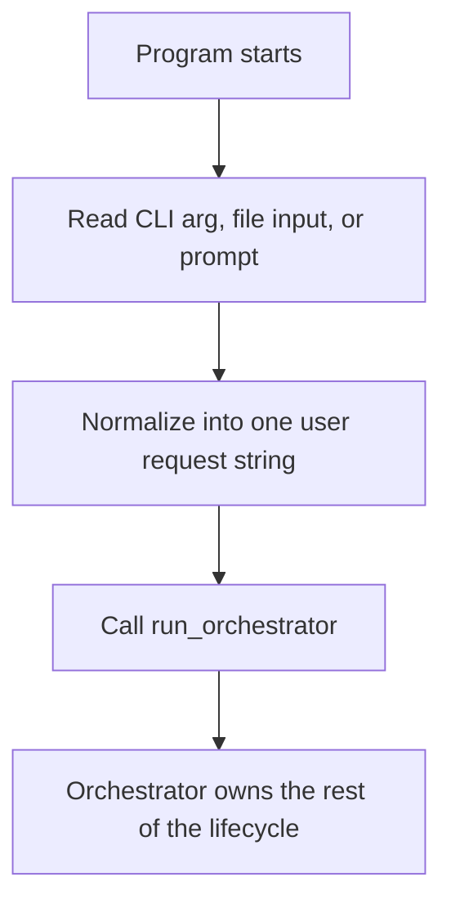

# `mcp_apps/orchestrator/app/main.py`

Source path: `mcp_apps/orchestrator/app/main.py`

Role: CLI-facing entrypoint for the orchestrator.

Responsibilities:

- Accept a request from arguments, a file, or interactive input
- Normalize that request into one prompt string
- Hand control to `run_orchestrator`

## Story

This file is the front door of the orchestrator app. It turns whatever the user provided into one clean request string and then hands control to the runtime orchestrator.

## Terms

- `module role`: The narrow job this file performs in the larger system.
- `flow`: The sequence of steps or decisions described by the file.
- `boundary`: The limit of what the file should own versus what callers should handle elsewhere.

## Mermaid

