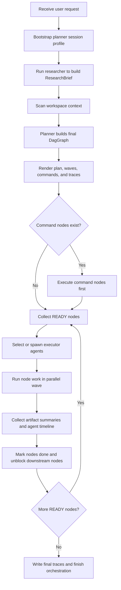

# `mcp_apps/orchestrator/app/orchestrator.py`

Source path: `mcp_apps/orchestrator/app/orchestrator.py`

Role: Main execution coordinator for the full planning and coding flow after the DAG has already been constructed.

Responsibilities:

- Bootstrap session state and research
- Scan the workspace and request a finalized DAG from the planner/DAG-builder pipeline
- Export planner traces and human-readable reports
- Execute command nodes before edit waves
- Schedule ready nodes across reusable or fresh executors
- Retire the current agent when the flow requires a fresh branch executor or a post-merge reset
- Ask the context compactor for a reduced handoff summary before spawning the next agent
- Treat the compacted handoff context as ground truth for the next iteration
- Track summaries, waves, agent retirement, and agent timelines until completion

## Story

This file is the conductor of the whole runtime flow. It starts with the user request, collects research and workspace context, asks the planner for a graph, runs command nodes before edit nodes, manages parallel waves of execution, retires agents when the graph demands it, and finishes by exporting the execution trail.

## Terms

- `DAG`: The execution graph that defines node order and dependency structure.
- `wave`: A set of ready nodes that may execute in the same scheduling pass.
- `handoff packet`: The compact context emitted for the next executor agent.
- `fresh agent`: A newly spawned executor used instead of reusing prior branch context.

## Handoff Contract

- When a branch ends, merges, or explicitly requires a fresh executor, the current agent should not carry forward the full original conversation context.
- Before retirement, the orchestrator asks `context_compactor.py` to synthesize a small ground-truth handoff package.
- The next executor receives only that compact package plus the current node contract, not the full historical prompt chain.
- This keeps context small and forces each iteration to rely on an explicit summarized state instead of accumulated prompt drift.

## Mermaid

