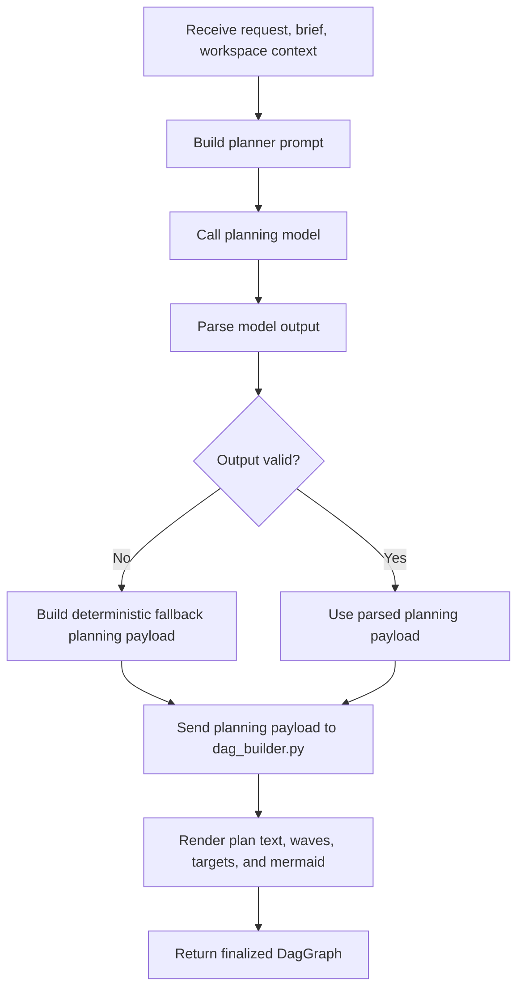

# `mcp_apps/orchestrator/app/planner.py`

Source path: `mcp_apps/orchestrator/app/planner.py`

Role: Planner front-end that prepares planning inputs and delegates actual DAG construction to a dedicated DAG builder module.

Responsibilities:

- Build the structured planner prompt from user request, research brief, and workspace context
- Parse planner-model output into intermediate planning data
- Hand intermediate planning data to `dag_builder.py` for final DAG construction
- Render workspace trees, plans, and mermaid output from the finalized DAG
- Clamp edits to executor-safe bounds
- Fall back to deterministic planning input when model output is invalid

## Story

This file is the planning front-end. It gathers the request, research, and workspace state, turns them into a planner prompt, validates the model output, and hands the intermediate planning payload to the DAG builder so the actual scheduling logic stays in one place.

## Terms

- `planning payload`: The structured planning data produced before final DAG construction.
- `prerequisite`: An upstream node that must finish before a downstream node can run.
- `incoming edge`: A dependency edge entering a node from an immediate upstream node.
- `outgoing edge`: A dependency edge leaving a node toward a downstream node.

## Architectural Boundary

- `planner.py` is not the final home for dependency analysis or project scheduling rules.
- Node prerequisite resolution, parallelism decisions, merge detection, and execution-wave derivation belong in `dag_builder.py`.
- This separation keeps prompt orchestration readable and keeps scheduling logic in one file.

## Mermaid

