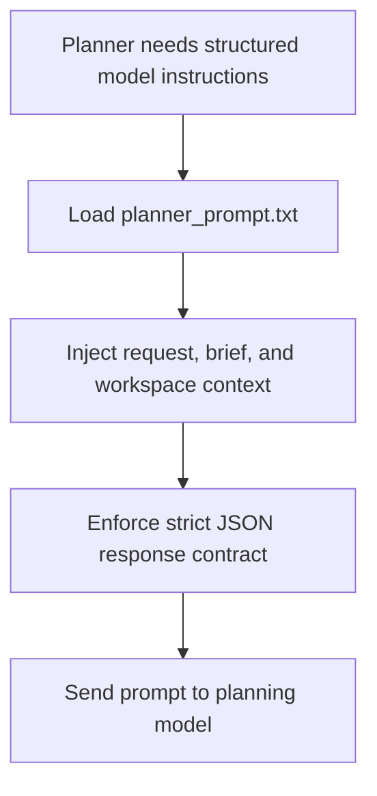

# `mcp_apps/orchestrator/app/prompts/planner_prompt.txt`

Source path: `mcp_apps/orchestrator/app/prompts/planner_prompt.txt`

Role: Template prompt for planner-model DAG generation.

Responsibilities:

- Define the required JSON response shape
- Encode planning rules and lifecycle constraints
- Keep prompt content out of Python control flow

## Story

This file is the planner's script page. It holds the structured instructions that tell the planning model what shape of output is allowed and what constraints the resulting graph must satisfy.

## Terms

- `prompt template`: The stored instruction text sent to the planner model.
- `strict JSON`: A response contract that forbids extra prose or markdown fences.
- `constraint`: A rule the planner output must obey.

## Mermaid

