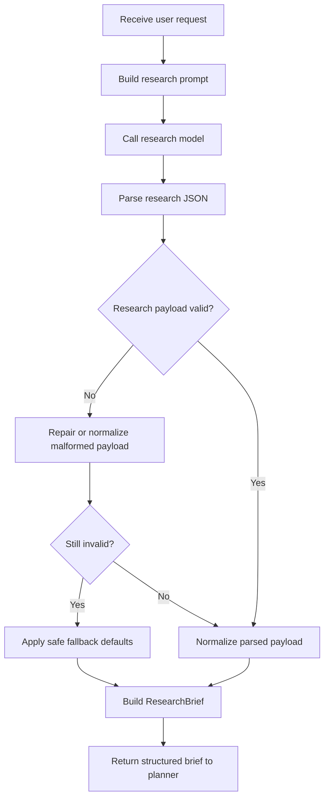

# `mcp_apps/orchestrator/app/researcher.py`

Source path: `mcp_apps/orchestrator/app/researcher.py`

Role: Produces a structured `ResearchBrief` from the user request.

Responsibilities:

- Infer likely stack and project shape
- Normalize malformed or incomplete model output
- Supply setup, run, and test commands when available
- Provide resilient fallback defaults when research generation fails

## Story

This file is the scout that moves ahead of the planner. It studies the user request, tries to infer the likely stack and operating constraints, repairs malformed model output when possible, and returns a structured brief the planner can trust.

## Terms

- `ResearchBrief`: The structured result of the research phase.
- `normalization`: Repairing or regularizing model output into the expected schema.
- `fallback default`: A safe substitute value used when model output is incomplete or invalid.

## Mermaid

