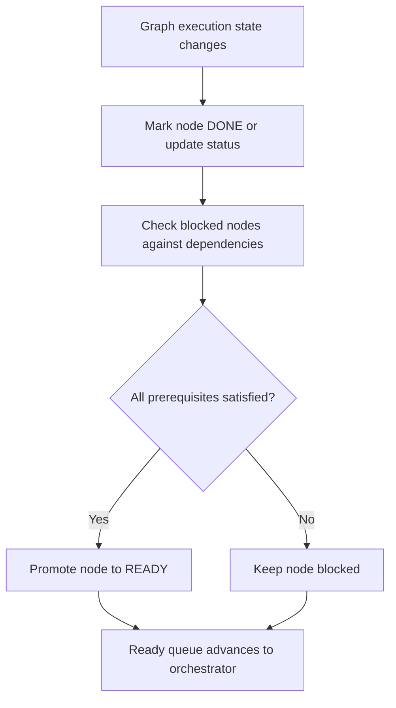

# `mcp_apps/orchestrator/app/state_manager.py`

Source path: `mcp_apps/orchestrator/app/state_manager.py`

Role: Tracks DAG node state during execution.

Responsibilities:

- Mark nodes complete
- Promote blocked nodes into `READY` when dependencies clear
- Keep execution status updates separate from planning logic

## Story

This file is the traffic controller for graph execution state. Its job is to track what is blocked, what is ready, and what has already finished so the orchestrator can move the graph forward without recomputing execution status from scratch every time.

## Terms

- `READY`: A node state meaning the node is eligible to execute now.
- `blocked node`: A node whose prerequisites are not yet fully satisfied.
- `dependency satisfaction`: The condition where all required upstream nodes have completed.

## Mermaid

