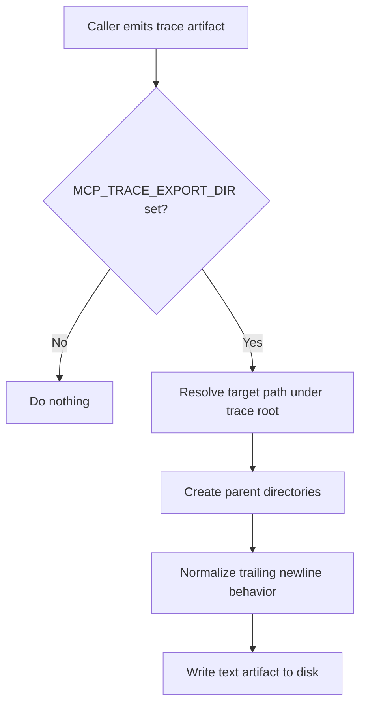

# `mcp_apps/orchestrator/app/trace_exporter.py`

Source path: `mcp_apps/orchestrator/app/trace_exporter.py`

Role: Writes trace artifacts to disk when export is enabled.

Responsibilities:

- Read `MCP_TRACE_EXPORT_DIR`
- Create parent directories automatically
- Persist planner and execution reports as normalized text files

## Story

This file is the run notebook. Whenever trace export is enabled, it takes planner and execution artifacts and writes them to disk so the run can be inspected later without having to replay the entire flow.

## Terms

- `trace root`: The folder where execution artifacts are written.
- `artifact`: A saved file that captures part of planning or execution state.
- `normalized text`: A stored text payload with consistent newline handling.

## Mermaid

