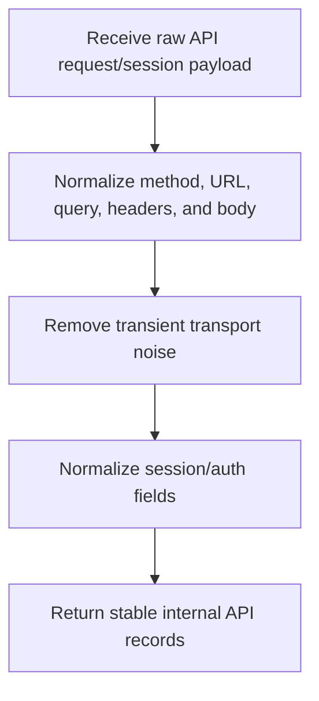

# `mcp_apps/orchestrator/libraries/auth/api_converter.py`

Source path: `mcp_apps/orchestrator/libraries/auth/api_converter.py`

Role: Converts raw API request and session payloads into normalized internal records. This module is API-only and must not depend on browser traffic capture concepts.

Responsibilities:

- Normalize HTTP method, URL, headers, query params, and body payloads
- Convert API authentication/session material into typed internal structures
- Strip transport noise so downstream modules work with stable request contracts
- Remain independent from Playwright, browser events, page state, or captured browser traffic

## Design Constraints

- No mention of browser pages, HAR records, DOM state, or browser capture.
- The module may process cookie-like values if they arrived from an API response, but it does not know or care whether a browser exists.
- Any runtime that needs browser automation must be documented elsewhere, not here.

## Story

This file is a translator for transport data. It takes raw API-level request or session shapes and normalizes them into stable internal records so higher-level modules do not have to reason about inconsistent wire formats.

## Terms

- `normalized request`: A request shape converted into the project's canonical internal format.
- `transport noise`: Headers or metadata that are not meaningful at the orchestration level.
- `session payload`: The auth-related data needed to reuse access later.

## Mermaid

