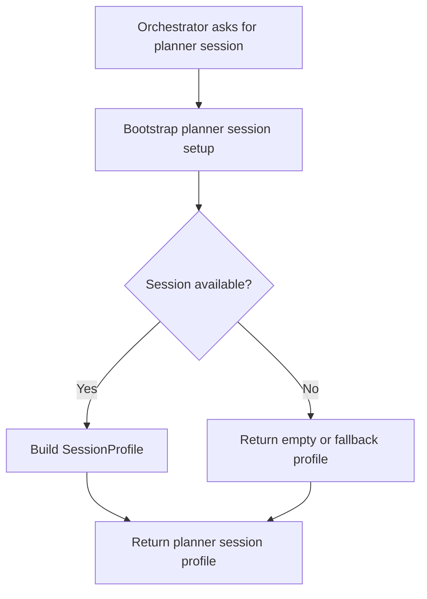

# `mcp_apps/orchestrator/libraries/auth/playwright_setup.py`

Source path: `mcp_apps/orchestrator/libraries/auth/playwright_setup.py`

Role: Session bootstrap bridge for planner-side authentication context.

Responsibilities:

- Create or fetch a planner session profile
- Bridge browser-derived auth into the orchestrator flow
- Keep session setup outside the planner and executor logic

## Story

This file is a session bootstrap bridge. Its purpose is to produce or recover the session shape that the orchestrator expects before planning begins.

## Terms

- `SessionProfile`: The stored shape of headers and cookies used by the planner path.
- `bootstrap`: The act of creating or recovering the initial runtime session state.
- `persistence`: Saving data so it can be reused later.

## Mermaid

