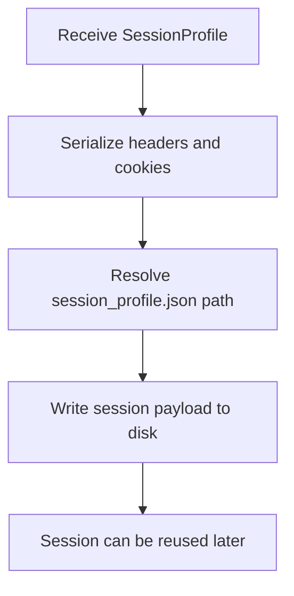

# `mcp_apps/orchestrator/libraries/auth/session_store.py`

Source path: `mcp_apps/orchestrator/libraries/auth/session_store.py`

Role: Persists captured session state for reuse.

Responsibilities:

- Write `SessionProfile` data to disk
- Store headers and cookies in a reusable format
- Separate auth persistence from session capture

## Story

This file is the memory box for session state. It persists session information so the rest of the system can reuse it without repeating the full bootstrap path.

## Terms

- `SessionProfile`: The stored shape of headers and cookies used by the planner path.
- `bootstrap`: The act of creating or recovering the initial runtime session state.
- `persistence`: Saving data so it can be reused later.

## Mermaid

