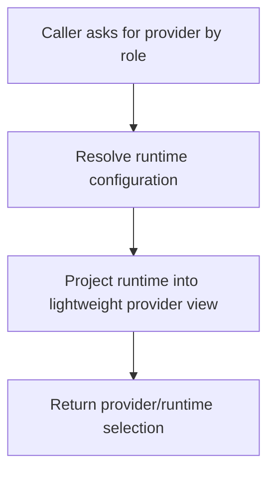

# `mcp_apps/orchestrator/libraries/providers/research_provider_factory.py`

Source path: `mcp_apps/orchestrator/libraries/providers/research_provider_factory.py`

Role: Selects the runtime/provider view for research-oriented tasks.

Responsibilities:

- Resolve provider configuration by role
- Return a lightweight runtime view
- Keep provider lookup out of orchestration logic

## Story

This file is a small provider selector. It takes a role-oriented request and turns it into a runtime/provider view that the research stage can use without carrying the whole server-side runtime object around.

## Terms

- `provider runtime view`: A narrowed view of provider configuration used by higher-level code.
- `role`: A logical use of the model such as planner, researcher, or executor.
- `selection`: Choosing the correct provider path for the current role.

## Mermaid

