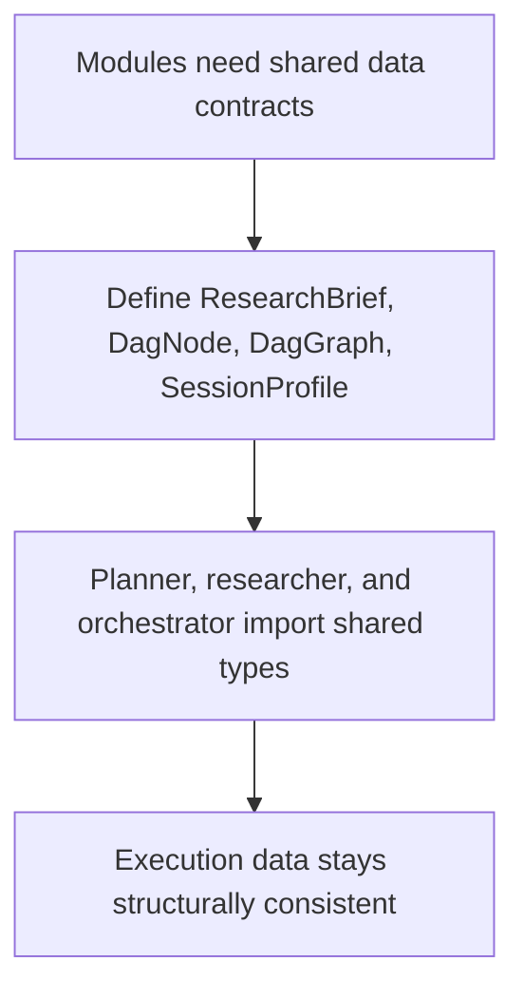

# `mcp_apps/orchestrator/libraries/types/contracts.py`

Source path: `mcp_apps/orchestrator/libraries/types/contracts.py`

Role: Defines the orchestrator's core data contracts.

Responsibilities:

- Model `ResearchBrief`, `DagNode`, and `DagGraph`
- Represent session metadata with `SessionProfile`
- Give planners, researchers, and executors a shared typed language

## Story

This file is the shared language for the orchestrator side of the system. It defines the data shapes that let the researcher, planner, DAG builder, and orchestrator pass information without guessing about structure.

## Terms

- `contract`: A defined data shape shared between modules.
- `typed structure`: A data object with explicit expected fields.
- `shared language`: A consistent vocabulary of objects across subsystems.

## Mermaid

