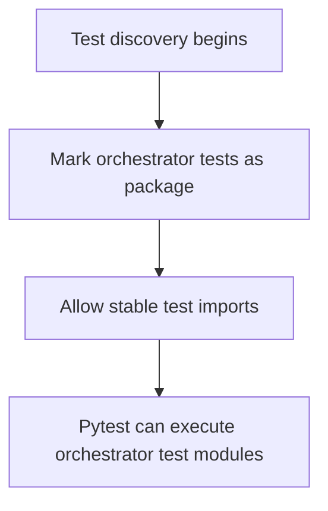

# `mcp_apps/orchestrator/tests/__init__.py`

Source path: `mcp_apps/orchestrator/tests/__init__.py`

Role: Package marker for orchestrator tests.

Responsibilities:

- Support consistent test discovery and imports

## Story

This file is mostly structural rather than procedural. In the story of the codebase, it marks a folder as a real Python package so imports, test discovery, and namespace resolution work the way the rest of the system expects.

## Terms

- `package`: A Python directory that can be imported as a module namespace.
- `namespace`: The import path under which child modules are resolved.
- `import resolution`: The process Python uses to locate and load modules.

## Mermaid

