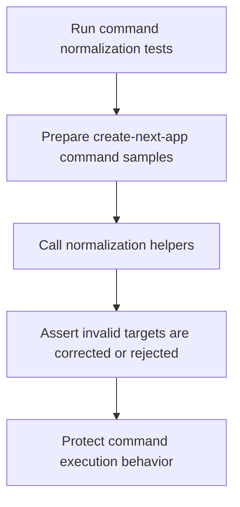

# `mcp_apps/orchestrator/tests/test_orchestrator_command_normalization.py`

Source path: `mcp_apps/orchestrator/tests/test_orchestrator_command_normalization.py`

Role: Guards command normalization behavior in the orchestrator.

Responsibilities:

- Verify `create-next-app` command cleanup
- Protect dot-target safety rules
- Catch regressions in command preprocessing

## Story

This file is a guardrail for the behavior described by the surrounding module docs. Its job is to exercise one narrow slice of logic and fail loudly when a change breaks an assumption the rest of the system depends on.

## Terms

- `module under test`: The file or behavior the test is exercising.
- `assertion`: A condition that must be true for the test to pass.
- `invariant`: A property of the system that should remain stable across changes.

## Mermaid

