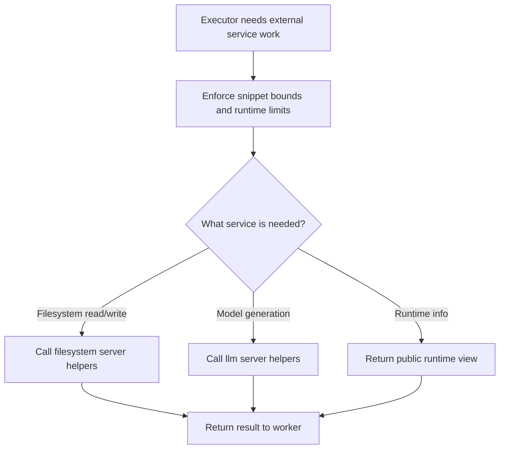

# `mcp_clients/agent_executor/client/mcp_router.py`

Source path: `mcp_clients/agent_executor/client/mcp_router.py`

Role: Client-side router between executor logic and MCP-style services.

Responsibilities:

- Request bounded file snippets
- Submit generation calls to the LLM server
- Apply edits through the filesystem server
- Expose a safe provider runtime view to the client layer

## Story

This file is the courier between the executor and the servers. It knows how to ask the filesystem server for bounded snippets, how to ask the LLM server for generation, and how to keep the worker inside the limits of its contract.

## Terms

- `router`: The module that forwards executor work to the appropriate server helper.
- `runtime view`: The safe subset of provider runtime metadata exposed to the client side.
- `bounds enforcement`: The rule that limits how much code the worker may touch.

## Mermaid

