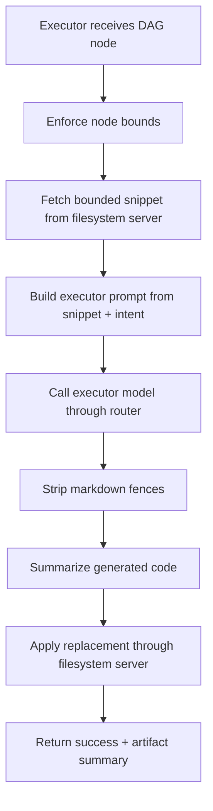

# `mcp_clients/agent_executor/client/worker.py`

Source path: `mcp_clients/agent_executor/client/worker.py`

Role: Executes a single bounded code-edit task.

Responsibilities:

- Fetch the permitted source snippet
- Build the executor prompt
- Strip accidental markdown fences from model output
- Summarize generated code for downstream abstraction context
- Write the bounded replacement back through the router

## Story

This file is the bounded editor. It receives one DAG node, reads only the allowed snippet, builds a prompt for the model, cleans the response, applies the edit, and emits a compact summary for the next stage of execution.

## Terms

- `bounded snippet`: The exact slice of code the worker is allowed to read or replace.
- `mutation intent`: The change description attached to a DAG node.
- `artifact summary`: A compact description of what the generated edit produced.
- `executor prompt`: The minimal prompt built for one low-context code mutation step.

## Mermaid

