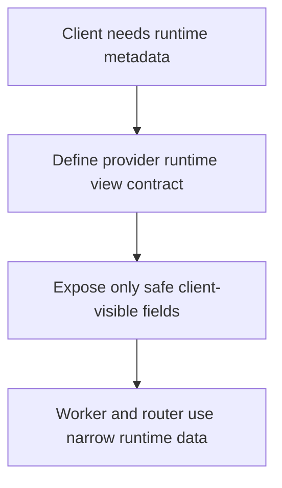

# `mcp_clients/agent_executor/libraries/types/contracts.py`

Source path: `mcp_clients/agent_executor/libraries/types/contracts.py`

Role: Defines the executor-facing runtime contract.

Responsibilities:

- Model the public provider/runtime view needed by the client
- Keep client-visible runtime data narrower than the server-side internal contract

## Story

This file defines the executor-side contract for runtime metadata. It keeps the worker and router limited to the small slice of runtime information they actually need.

## Terms

- `contract`: A defined data shape shared between modules.
- `typed structure`: A data object with explicit expected fields.
- `shared language`: A consistent vocabulary of objects across subsystems.

## Mermaid

