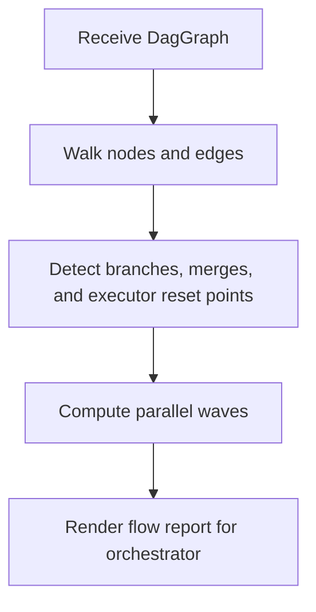

# `mcp_clients/agent_executor/tools/flow_parser.py`

Source path: `mcp_clients/agent_executor/tools/flow_parser.py`

Role: Analyzes DAG structure to guide executor reuse and branching.

Responsibilities:

- Detect merges and branch points
- Decide when a fresh executor is required
- Describe parallel waves and flow shape for reporting

## Story

This file is the graph reader for execution shape. It looks at the DAG after planning and explains where branches, merges, and executor reset boundaries exist so the orchestrator can schedule work with the correct mental model.

## Terms

- `merge point`: A place in the graph where multiple branches converge.
- `parallel wave`: A set of nodes that can run during the same scheduling step.
- `reset boundary`: A place where the current executor should be retired and replaced.

## Mermaid

