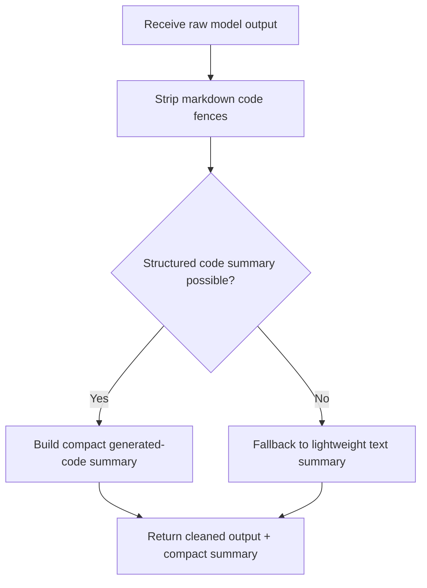

# `mcp_clients/agent_executor/tools/response_parser.py`

Source path: `mcp_clients/agent_executor/tools/response_parser.py`

Role: Normalizes generated code responses into concise summaries.

Responsibilities:

- Strip markdown fences
- Parse Python structure when possible
- Produce short abstractions that help later nodes understand prior edits

## Story

This file is the response cleaner and summarizer. It takes raw model output, strips away wrapping noise such as markdown fences, and turns the result into a compact artifact summary that can survive a low-context handoff.

## Terms

- `code fence`: Markdown wrapping that should be removed before applying code.
- `compact summary`: A short artifact description small enough for later handoff.
- `cleaned output`: The model response after wrapper text has been removed.

## Mermaid

