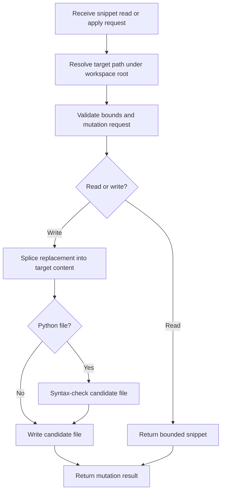

# `mcp_servers/filesystem_server/server/file_mutator.py`

Source path: `mcp_servers/filesystem_server/server/file_mutator.py`

Role: Safe bounded file reader and mutator for workspace edits.

Responsibilities:

- Resolve target files under the workspace root
- Read bounded snippets by line range
- Apply replacements or create files when appropriate
- Validate Python syntax before finalizing Python edits

## Story

This file is the careful file surgeon. It resolves paths, validates bounds, reads snippets, splices replacements into files, and checks Python syntax before it allows certain edits to stick.

## Terms

- `workspace root`: The allowed root folder for filesystem operations.
- `splice`: Replacing a bounded region of file content with new text.
- `syntax check`: Validating Python code before finalizing a write.

## Mermaid

