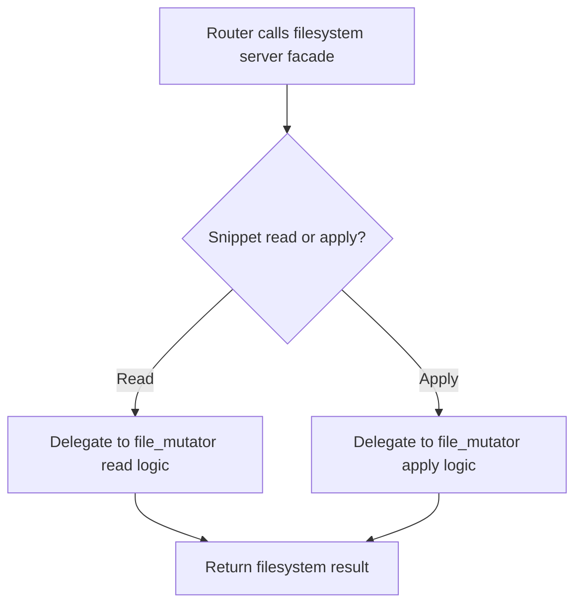

# `mcp_servers/filesystem_server/server/index.py`

Source path: `mcp_servers/filesystem_server/server/index.py`

Role: Public server interface for filesystem operations.

Responsibilities:

- Expose higher-level snippet read and apply functions
- Delegate low-level work to `file_mutator.py`
- Keep server entrypoints narrower than mutation internals

## Story

This file is the facade of the filesystem server. It receives high-level requests from the router and forwards them into the lower-level mutation logic.

## Terms

- `workspace root`: The allowed root folder for filesystem operations.
- `splice`: Replacing a bounded region of file content with new text.
- `syntax check`: Validating Python code before finalizing a write.

## Mermaid

