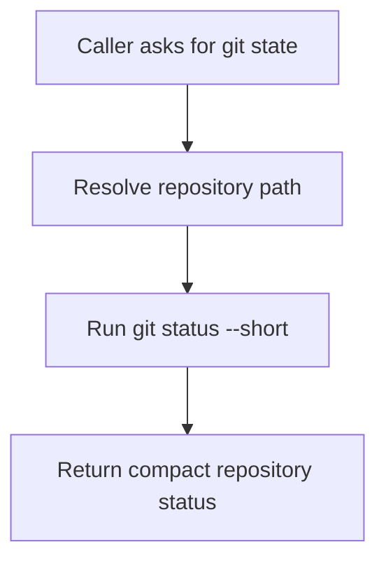

# `mcp_servers/git_server/server/index.py`

Source path: `mcp_servers/git_server/server/index.py`

Role: Minimal git-service facade.

Responsibilities:

- Expose repository status checks
- Keep git access isolated from the rest of the stack

## Story

This file is the small git inspector. It exists to expose a narrow repository-status view without dragging git process logic into the rest of the application.

## Terms

- `repository status`: A compact view of current tracked and modified files.
- `facade`: A narrow public wrapper over lower-level behavior.
- `git command`: The underlying repository operation performed by this module.

## Mermaid

