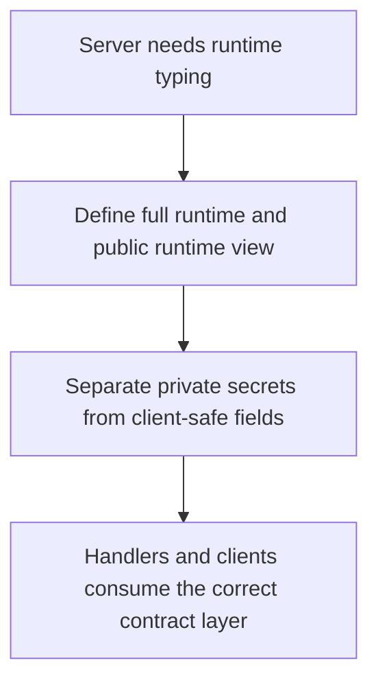

# `mcp_servers/llm_server/libraries/types/contracts.py`

Source path: `mcp_servers/llm_server/libraries/types/contracts.py`

Role: Defines the LLM server's runtime contracts.

Responsibilities:

- Separate full private runtime data from safe public views
- Represent provider configuration, credentials, and limits in typed form

## Story

This file defines the LLM server's runtime contracts. It separates the full private runtime shape from the smaller public view that client-side code is allowed to see.

## Terms

- `contract`: A defined data shape shared between modules.
- `typed structure`: A data object with explicit expected fields.
- `shared language`: A consistent vocabulary of objects across subsystems.

## Mermaid

