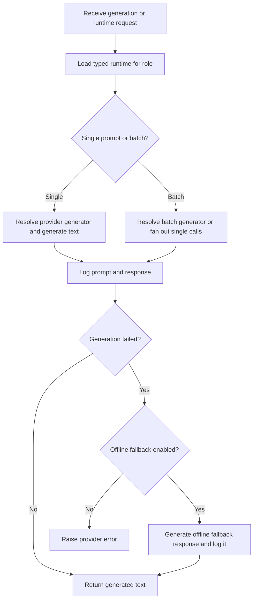

# `mcp_servers/llm_server/server/agents/entrypoint.py`

Source path: `mcp_servers/llm_server/server/agents/entrypoint.py`

Role: Main provider-side execution entrypoint.

Responsibilities:

- Load typed runtimes
- Generate planner, researcher, and executor responses
- Build planner session profiles
- Write traces and invoke offline fallback when needed

## Story

This file is the provider-side conductor. It loads the runtime for a role, selects the right provider path, handles batch versus single generation, writes traces, and falls back to offline responses if the configured mode allows that.

## Terms

- `runtime`: The provider configuration loaded for a given role.
- `provider generator`: The function that actually calls a specific model provider.
- `offline fallback`: A substitute response path used when live generation fails.
- `trace log`: A saved prompt/response record for debugging.

## Mermaid

