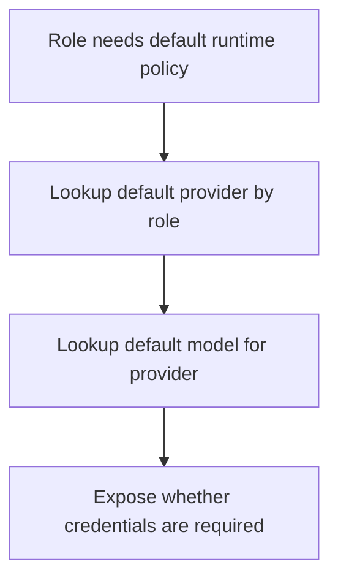

# `mcp_servers/llm_server/server/agents/modules/defaults.py`

Source path: `mcp_servers/llm_server/server/agents/modules/defaults.py`

Role: Default provider/model policy table.

Responsibilities:

- Define provider defaults per role
- Define model defaults per provider
- Encode which providers require credentials

## Story

This file is the policy table for default provider behavior. It answers questions like which provider belongs to which role and which default model should be used when nothing more specific is set.

## Terms

- `default provider`: The provider chosen when a role has no explicit override.
- `default model`: The model chosen for a provider when no specific model is configured.
- `credential requirement`: Whether a provider must have an API key to run.

## Mermaid

