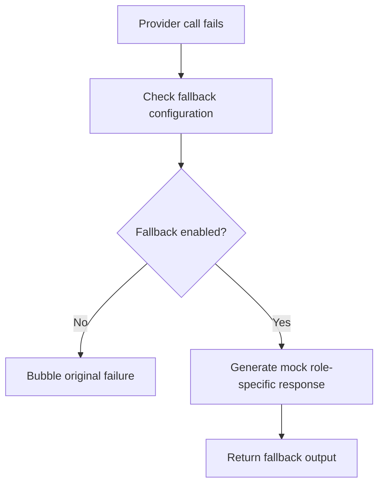

# `mcp_servers/llm_server/server/agents/modules/offline_fallback.py`

Source path: `mcp_servers/llm_server/server/agents/modules/offline_fallback.py`

Role: Safe fallback path when live provider generation is unavailable.

Responsibilities:

- Return role-shaped mock responses
- Let the rest of the pipeline continue in offline or degraded mode
- Keep fallback behavior centralized

## Story

This file is the emergency understudy. When a real provider call fails and fallback is allowed, it produces substitute output so the rest of the pipeline can still move.

## Terms

- `fallback mode`: The mode where mock outputs are allowed if live calls fail.
- `role-shaped response`: A fallback output that matches the expected type of the current role.
- `provider failure`: An exception or error returned by the live provider path.

## Mermaid

