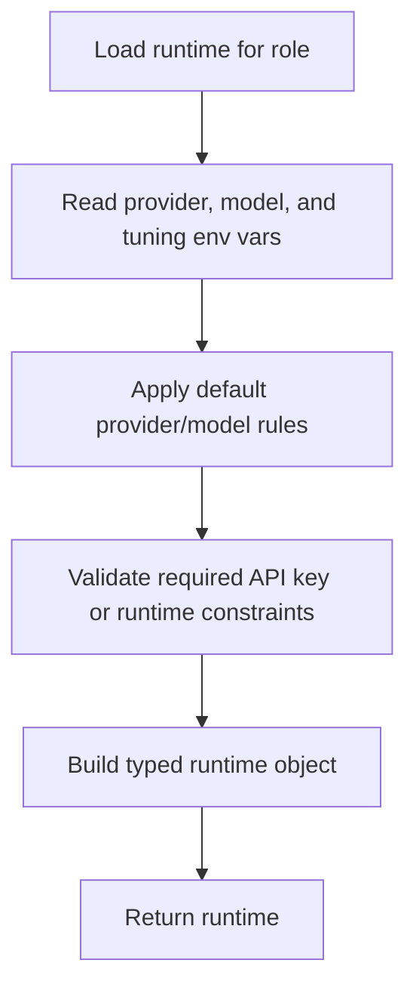

# `mcp_servers/llm_server/server/agents/modules/runtime_loader.py`

Source path: `mcp_servers/llm_server/server/agents/modules/runtime_loader.py`

Role: Converts environment configuration into typed provider runtimes.

Responsibilities:

- Read provider, model, API key, and generation settings
- Enforce required credential checks
- Produce runtime objects used by the provider entrypoint

## Story

This file is the runtime assembler. It reads environment values, applies defaults, validates what is required, and returns a typed runtime object that the provider layer can actually execute with.

## Terms

- `environment config`: The provider and tuning values loaded from environment variables.
- `typed runtime`: The validated runtime object returned to the provider layer.
- `validation`: Checking that required fields such as API keys are present.

## Mermaid

