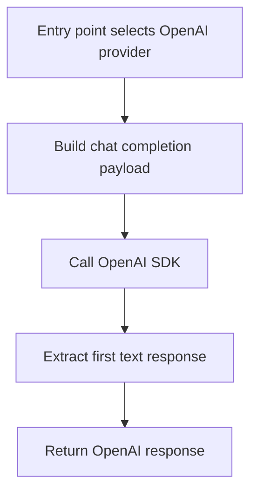

# `mcp_servers/llm_server/server/agents/vendors/openai_agent.py`

Source path: `mcp_servers/llm_server/server/agents/vendors/openai_agent.py`

Role: OpenAI-specific generation adapter.

Responsibilities:

- Translate typed runtime settings into `openai` SDK requests
- Return the first normalized text response for downstream use

## Story

This file is a provider-specific adapter. It takes the generic runtime chosen by the system and turns it into a concrete SDK or API call for one vendor, then normalizes the returned text back into the common flow.

## Terms

- `vendor adapter`: A provider-specific implementation that calls one model backend.
- `SDK call`: The concrete library or API request used to obtain model output.
- `normalized text`: A provider response reduced to the common text form used elsewhere.

## Mermaid

