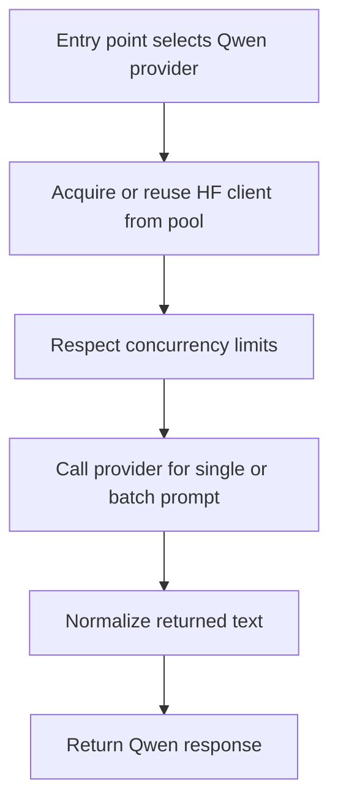

# `mcp_servers/llm_server/server/agents/vendors/qwen_agent.py`

Source path: `mcp_servers/llm_server/server/agents/vendors/qwen_agent.py`

Role: Qwen/Hugging Face generation adapter with pooling and concurrency controls.

Responsibilities:

- Reuse client instances across calls
- Limit concurrent requests with explicit coordination
- Support both single and batched prompt generation

## Story

This file is a provider-specific adapter. It takes the generic runtime chosen by the system and turns it into a concrete SDK or API call for one vendor, then normalizes the returned text back into the common flow.

## Terms

- `vendor adapter`: A provider-specific implementation that calls one model backend.
- `SDK call`: The concrete library or API request used to obtain model output.
- `normalized text`: A provider response reduced to the common text form used elsewhere.

## Mermaid

