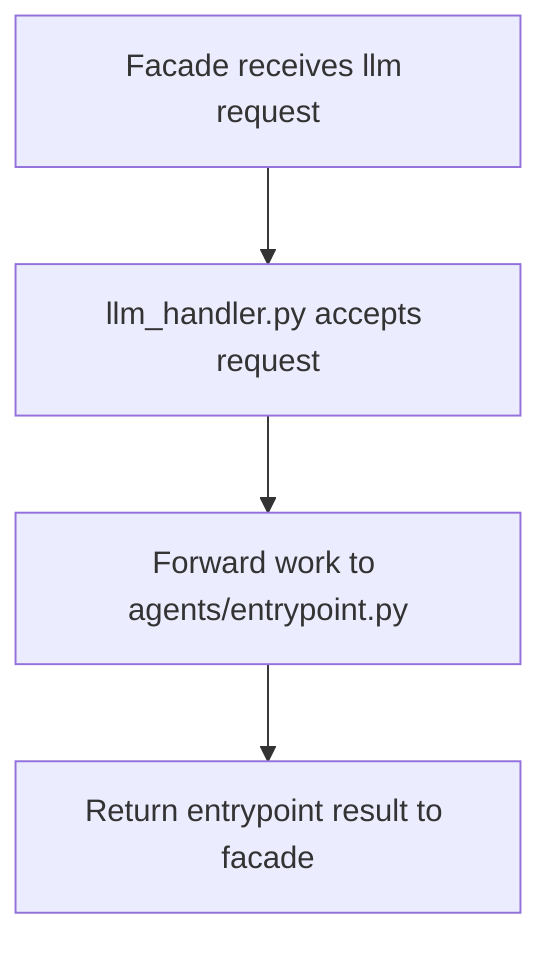

# `mcp_servers/llm_server/server/handlers/llm_handler.py`

Source path: `mcp_servers/llm_server/server/handlers/llm_handler.py`

Role: Thin server-facing handler layer for LLM operations.

Responsibilities:

- Receive requests from the facade
- Forward work to the deeper agent entrypoint
- Keep API surface stable while logic stays lower in the stack

## Story

This file is the front desk of the LLM server. It accepts requests from the facade layer and forwards them into the deeper entrypoint logic without owning the provider behavior itself.

## Terms

- `handler`: A layer that accepts a request and forwards it deeper into the subsystem.
- `facade`: A simple public entry surface hiding deeper implementation detail.
- `forwarding`: Passing work to the module that actually owns the behavior.

## Mermaid

