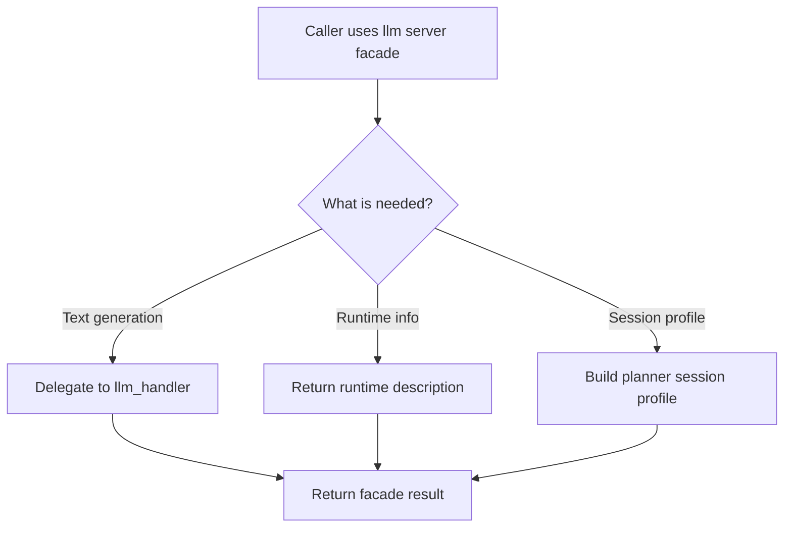

# `mcp_servers/llm_server/server/index.py`

Source path: `mcp_servers/llm_server/server/index.py`

Role: Compatibility facade for the LLM server.

Responsibilities:

- Offer simple named entrypoints to the rest of the repo
- Hide deeper handler and agent-plumbing details
- Keep cross-layer integrations stable

## Story

This file is the facade for the LLM server. It provides a simple entry surface to the rest of the repo while hiding the deeper provider and runtime plumbing.

## Terms

- `handler`: A layer that accepts a request and forwards it deeper into the subsystem.
- `facade`: A simple public entry surface hiding deeper implementation detail.
- `forwarding`: Passing work to the module that actually owns the behavior.

## Mermaid

