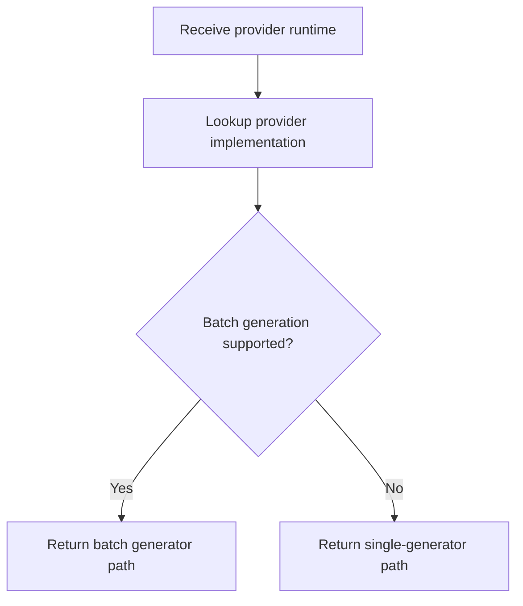

# `mcp_servers/llm_server/server/providers.py`

Source path: `mcp_servers/llm_server/server/providers.py`

Role: Provider dispatch switchboard for generation requests.

Responsibilities:

- Select the right provider implementation for a runtime
- Know when batch generation is supported
- Keep provider branching out of caller code

## Story

This file is the provider switchboard. It decides which generation path to use once a provider runtime has already been selected.

## Terms

- `provider switchboard`: The dispatch point that selects a concrete provider path.
- `single generation`: Generating one response for one prompt.
- `batch generation`: Generating several responses in one provider call when supported.

## Mermaid

