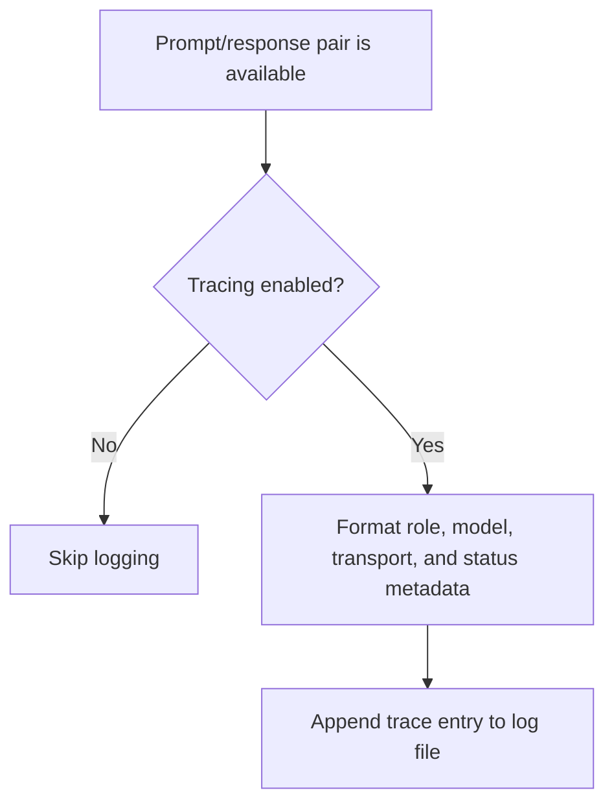

# `mcp_servers/llm_server/server/trace_logger.py`

Source path: `mcp_servers/llm_server/server/trace_logger.py`

Role: Prompt/response trace logger for provider activity.

Responsibilities:

- Persist timestamped request and response records
- Capture provider, model, role, transport, and fallback metadata
- Support later debugging of model interactions

## Story

This file is the archive clerk for model traffic. It records prompt and response pairs along with the metadata needed to explain what happened during a generation call.

## Terms

- `trace entry`: One logged prompt/response event with metadata.
- `transport`: The path used to generate output, such as live provider or fallback.
- `response status`: A label indicating success, fallback, or another result state.

## Mermaid

