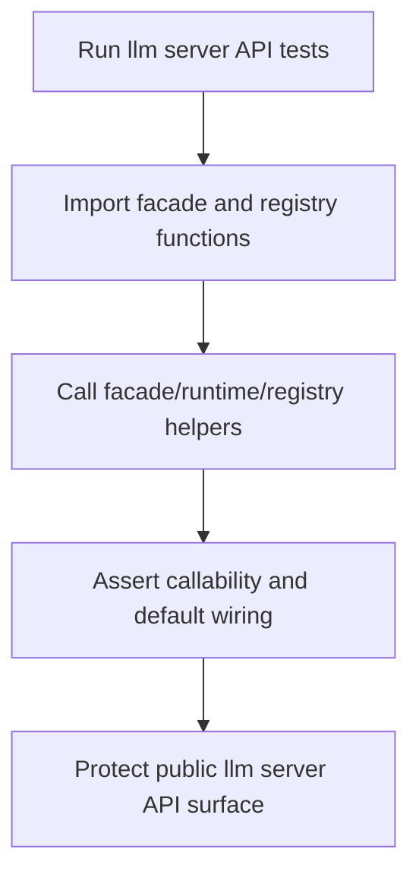

# `mcp_servers/llm_server/tests/test_agent_api_callability.py`

Source path: `mcp_servers/llm_server/tests/test_agent_api_callability.py`

Role: Contract tests for LLM server facade and provider registry wiring.

Responsibilities:

- Verify facade functions remain callable
- Confirm registry lookups return valid generators
- Protect default provider/model expectations

## Story

This file is a guardrail for the behavior described by the surrounding module docs. Its job is to exercise one narrow slice of logic and fail loudly when a change breaks an assumption the rest of the system depends on.

## Terms

- `module under test`: The file or behavior the test is exercising.
- `assertion`: A condition that must be true for the test to pass.
- `invariant`: A property of the system that should remain stable across changes.

## Mermaid

