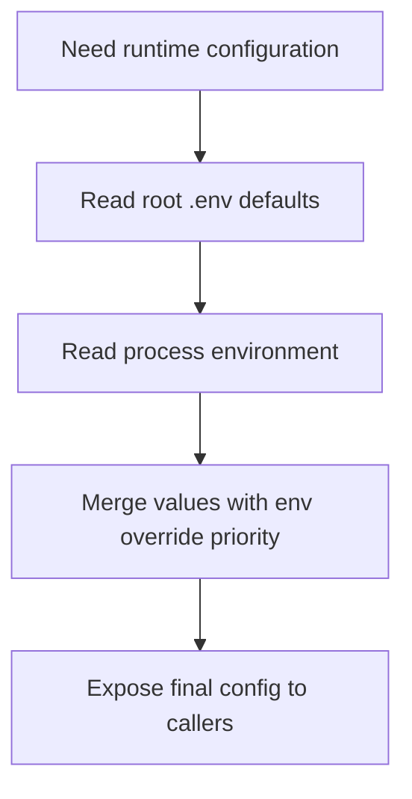

# `mcp_shared/config/env_loader.py`

Source path: `mcp_shared/config/env_loader.py`

Role: Loads the root `.env` file and merges it with the live process environment.

Responsibilities:

- Resolve configuration from one shared place
- Let real environment variables override file defaults
- Keep configuration bootstrapping out of higher-level modules

## Story

In the story of this codebase, this file acts as loads the root `.env` file and merges it with the live process environment. It exists so the surrounding modules can hand work to it at the right level of abstraction instead of each caller reimplementing the same behavior.

## Terms

- `module role`: The narrow job this file performs in the larger system.
- `flow`: The sequence of steps or decisions described by the file.
- `boundary`: The limit of what the file should own versus what callers should handle elsewhere.

## Mermaid

