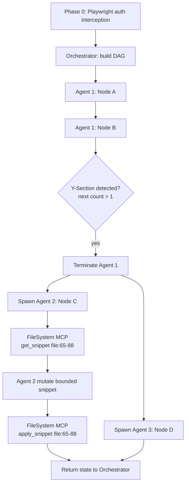

# Custom MCP Orchestration Engine (Python)

## 1) System Architecture and Role Mapping

### Roles
- Long-lived research agent (mcp_apps/orchestrator/app/researcher.py): produces structured research outputs (constraints, assumptions, risks).
- Long-lived planner (mcp_apps/orchestrator): consumes research brief, owns global DAG, dependency state, branch scheduling, and merge-ready result collation.
- Ephemeral developer workers (mcp_clients/agent_executor): each worker executes one linear path until a branch point is reached.
- Isolated MCP servers (mcp_servers): only servers can read and mutate files, so workers never write files directly.

### Core Interaction Contract
1. Research agent generates a structured research brief.
2. Planner builds DAG nodes with strict target_file/start_line/end_line bounds using request + research brief.
3. Orchestrator dispatches one node to one worker using bounded context only.
4. Worker calls FileSystem MCP server:
   - get_snippet(file, start_line, end_line)
   - apply_snippet(file, start_line, end_line, replacement)
5. FileSystem MCP server validates and performs deterministic splice.
6. Worker returns a structured result to planner.

### Environment Layering for Distributed Extensibility
- Root `.env` contains shared defaults that all categories can inherit.
- Category `.env` files (`mcp_apps/.env`, `mcp_clients/.env`, `mcp_servers/.env`) override root values only for that category.
- Process environment variables override both layers at runtime.
- Effective precedence: `process env > category .env > root .env`.
- This enables deploying apps, clients, and servers on different machines with category-local URLs.

### Provider-Agnostic Package Strategy
- Primary packages are model-agnostic: `mcp_apps/orchestrator` and `mcp_clients/agent_executor`.
- Legacy provider-named folders were removed to keep one canonical path per category.
- Provider selection is runtime-configured using env keys:
  - `RESEARCH_PROVIDER` and `RESEARCH_API_URL`
  - `PLANNER_PROVIDER` and `PLANNER_API_URL`
  - `EXECUTOR_PROVIDER` and `EXECUTOR_API_URL`
- Planner auth mode is runtime-configured using `PLANNER_AUTH_MODE` (for example: `api_key`, `oauth`, `playwright`).

### Phase 0 Playwright Session Bootstrap
- Browser launches in headless mode and performs login to UI LLM endpoint.
- Network observer captures auth headers, cookies, request body pattern, anti-CSRF fields.
- Session artifacts are encrypted and saved for browserless calls.
- API converter produces a raw HTTP profile:
  - url
  - required headers
  - body template mapping
  - retry and rate-limit settings

## 2) Strict Data Structures

## 2.1 DAG Schema

```json
{
  "graph_id": "feature-123",
  "created_at": "2026-04-14T09:00:00Z",
  "nodes": [
    {
      "node_id": "A",
      "status": "READY",
      "depends_on": [],
      "next": ["B"],
      "target_file": "services/auth/main.py",
      "start_line": 65,
      "end_line": 88,
      "mutation_intent": "replace token validation with cached key lookup",
      "acceptance_checks": ["unit:test_auth_validation"],
      "branch_key": "path-0"
    }
  ]
}
```

## 2.2 Python Contracts

```python
from dataclasses import dataclass
from typing import List, Dict

@dataclass
class DagNode:
    node_id: str
    status: str
    depends_on: List[str]
    next: List[str]
    target_file: str
    start_line: int
    end_line: int
    mutation_intent: str
    acceptance_checks: List[str]
    branch_key: str

@dataclass
class ResearchBrief:
  objective: str
  constraints: List[str]
  assumptions: List[str]
  risks: List[str]

@dataclass
class AgentContextPayload:
    agent_id: str
    graph_id: str
    node_id: str
    branch_key: str
    target_file: str
    start_line: int
    end_line: int
    snippet: str
    mutation_intent: str
    constraints: Dict[str, str]
```

## 2.3 Y-Section Spawn Payload

```json
{
  "spawn_reason": "BRANCH_SPLIT",
  "parent_agent_id": "agent-1",
  "child_payloads": [
    {
      "agent_id": "agent-2",
      "node_id": "C",
      "branch_key": "path-1",
      "target_file": "svc-a/app.py",
      "start_line": 120,
      "end_line": 160
    },
    {
      "agent_id": "agent-3",
      "node_id": "D",
      "branch_key": "path-2",
      "target_file": "svc-b/app.py",
      "start_line": 44,
      "end_line": 77
    }
  ]
}
```

## 3) Execution Algorithms (Pseudocode)

### 3.1 Phase 0 Playwright Hijack

```text
function bootstrap_session(config):
    browser = playwright.launch(headless=true)
    page = browser.new_page()
    interceptor = attach_network_interceptor(page)

    page.goto(config.login_url)
    perform_login(page, config.credentials)
    wait_until_logged_in(page)

    capture = interceptor.collect_first_matching_request(config.llm_request_pattern)
    tokens = extract_auth_material(capture.headers, capture.cookies, capture.body)

    session_store.save_encrypted(tokens)
    profile = api_converter.build_http_profile(capture)
    session_store.save_profile(profile)

    browser.close()
    return profile
```

### 3.2 Y-Section Lifecycle

```text
function execute_linear_path(agent, current_node):
    while true:
        process_node(agent, current_node)
        next_nodes = get_unblocked_next_nodes(current_node)

        if len(next_nodes) == 0:
            mark_agent_complete(agent)
            return

        if len(next_nodes) == 1:
            current_node = next_nodes[0]
            continue

        # Y-section reached
        terminate_agent(agent)
        for each node in next_nodes:
            spawn_ephemeral_agent(parent=agent.id, node=node)
        return
```

### 3.3 Deterministic File Splice

```text
function apply_snippet(file_path, start_line, end_line, replacement_text):
    lines = read_all_lines(file_path)

    assert start_line >= 1
    assert end_line >= start_line
    assert end_line <= len(lines)

    before = lines[0 : start_line - 1]
    after = lines[end_line : len(lines)]
    replacement_lines = split_lines_preserve_newlines(replacement_text)

    new_lines = before + replacement_lines + after

    if file_is_python(file_path):
        parse_ast(join(new_lines))  # fail fast on syntax corruption

    write_atomic(file_path, new_lines)
    return success
```

## 4) Protocol Flow Trace

1. Phase 0 auth runs in planner app and stores browserless LLM call profile.
2. Research agent produces a research brief.
3. Planner decomposes request + research brief into DAG nodes A -> B -> (C, D).
4. Agent 1 is spawned with node A context bounds only.
5. Agent 1 completes node A, then node B, sequentially.
6. Orchestrator evaluates next nodes and detects branch fan-out: C and D.
7. Agent 1 is terminated immediately by Y-section rule.
8. Agent 2 receives node C payload. Agent 3 receives node D payload.
9. Agent 2 asks FileSystem MCP server for file snippet lines 65-88 and receives only that range.
10. Agent 2 generates mutation and calls apply_snippet for lines 65-88.
11. FileSystem server validates line bounds and atomically writes splice.
12. Both child agents return completion metadata to planner.
13. Planner updates DAG statuses and schedules next unblocked work.

## 5) Mermaid Diagram



## 6) Structural Safety Guarantees

- Worker payload includes a single bounded region only.
- File mutation endpoint requires start_line/end_line and rejects out-of-range operations.
- Atomic write and optional AST parse prevent malformed writes.
- Agent cannot access filesystem directly, only through MCP server contracts.
- Every mutation is logged with graph_id/node_id/agent_id for deterministic replay.
